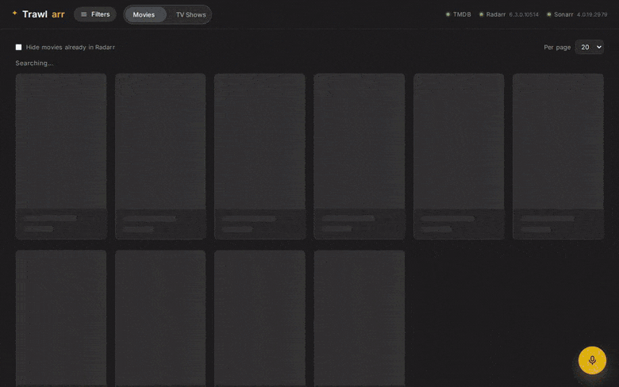
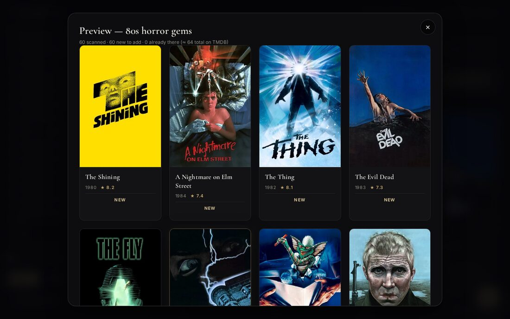
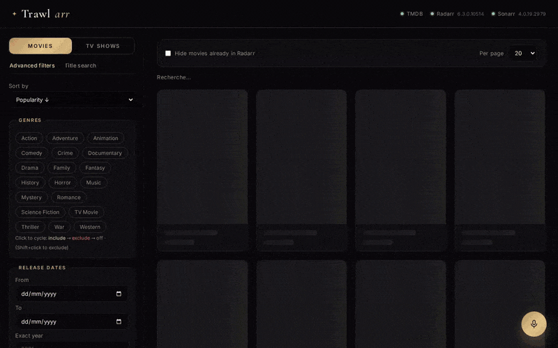
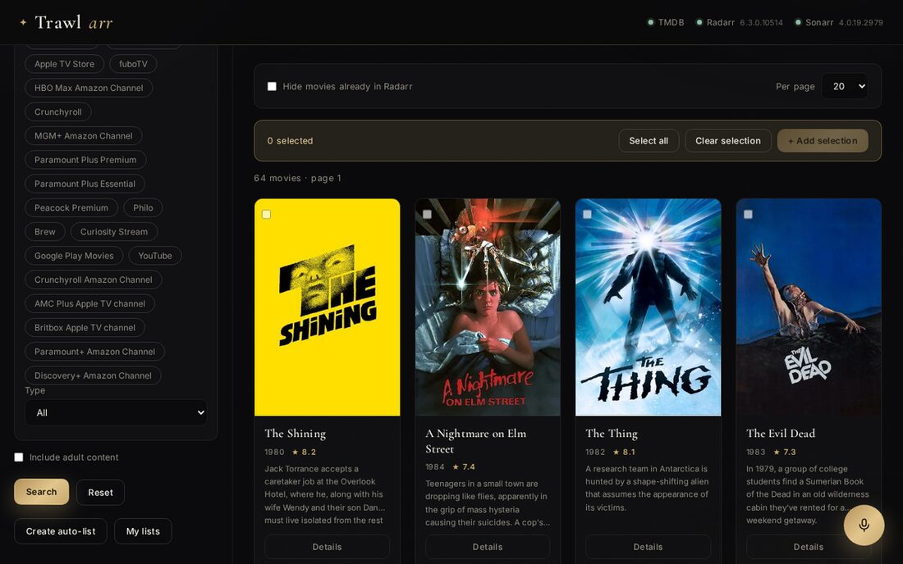
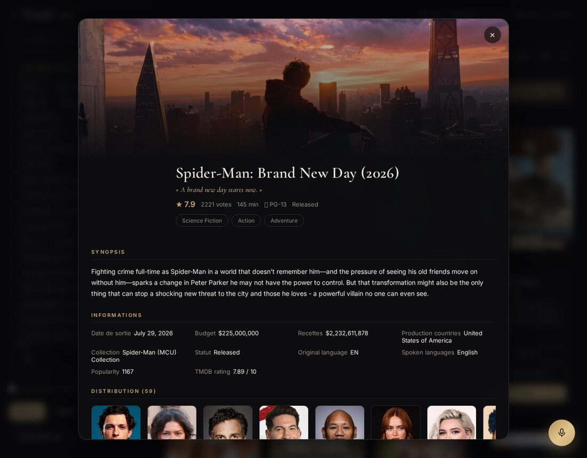
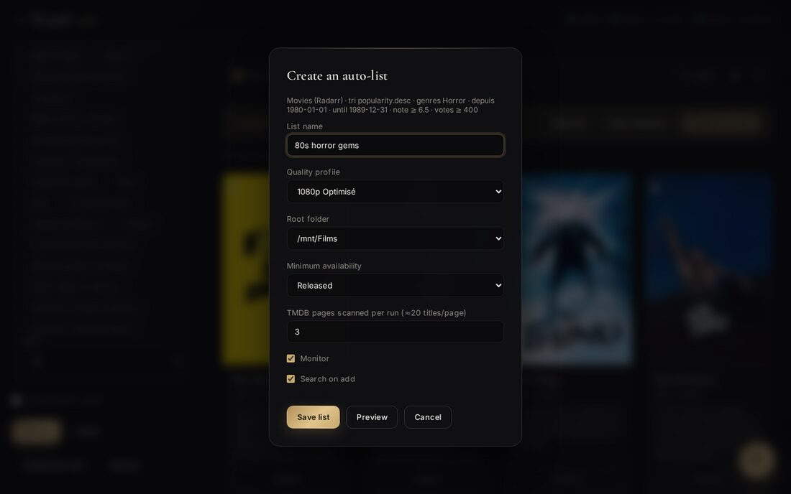
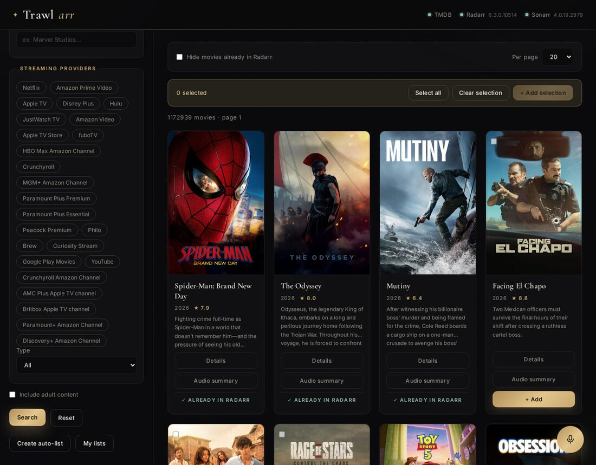

<div align="center">

# Trawlarr

**Cast a net over TMDB. Trawlarr keeps Radarr and Sonarr filled.**

Every TMDB Discover filter in front of your \*arr stack — plus saved searches that
keep adding new releases on their own, and an assistant you can just talk to.

[](LICENSE)
[](docker-compose.yml)
[](requirements.txt)
[](https://fastapi.tiangolo.com/)
[](https://radarr.video/)
[](https://sonarr.tv/)

</div>



---

## Why this exists

Radarr and Sonarr are excellent at **getting** what you ask for. They were never
built to help you **decide what to ask for**. Their add-search takes a title, and
that is the whole conversation.

But nobody thinks in titles. People think:

> *"80s horror, rated above 6.5, with enough votes that it isn't obscure."*
> *"Korean thrillers from the last five years that I don't already have."*
> *"Everything A24 ever produced."*

TMDB can answer all of that — its Discover API is genuinely powerful. Nothing
sat between it and the \*arr stack. **Trawlarr is that missing piece.**

## What you get

### 🎣 Every TMDB filter, not a title box

Genres to include **and** exclude, release windows, rating and vote-count floors,
runtime, original language, origin country, age certification, cast and crew,
keywords, production companies, streaming providers and monetisation type.
Results show what is **already in your library**, so you only see what is missing.

Select a handful — or all of them — and push them to Radarr or Sonarr in one click,
with the quality profile, root folder and monitoring you choose. Movies can pull
in **their whole collection** at the same time.

### 🔁 Turn any search into an auto-list

This is the part people keep for good.

Save a set of filters as a **list**. Trawlarr re-runs it every 12 hours and adds
whatever is new and matching, straight into Radarr or Sonarr. *"Every A24 film
that comes out"* stops being a chore and becomes a line in a list.

Preview a list before saving it: it tells you exactly how many titles it scanned,
how many are new, and how many you already own — without adding anything.

<p align="center"></p>

### 🎙️ Or just ask

Type — or say — *"highly rated sci-fi from the 90s"*, *"shows like Breaking Bad"*,
*"I don't know what to watch tonight"*. The assistant turns that into real filters,
applies them, and runs the search. Optional: it only wakes up if you give it a
Mistral API key.



It will also read you a **spoiler-free spoken summary** of any title, so you can
decide without reading three paragraphs.

---

## Quick start

```bash
git clone https://github.com/NoxzRCW/Trawlarr.git
cd Trawlarr
cp .env.example .env
$EDITOR .env          # TMDB_API_KEY + your Radarr / Sonarr URL and API key
docker compose up -d
```

Open **http://localhost:8080**. That is the whole install.

<details>
<summary>Prefer a plain <code>docker run</code>?</summary>

```bash
docker run -d --name trawlarr -p 8080:8080 \
  -e TMDB_API_KEY=xxxxx \
  -e RADARR_URL=http://radarr:7878 -e RADARR_API_KEY=xxxxx \
  -e SONARR_URL=http://sonarr:8989 -e SONARR_API_KEY=xxxxx \
  -v ./data:/data \
  ghcr.io/noxzrcw/trawlarr:latest
```

</details>

> **Radarr in another container?** Put Trawlarr on the same Docker network and use
> the service name (`http://radarr:7878`), or `http://host.docker.internal:7878`.

You need a free [TMDB API key](https://www.themoviedb.org/settings/api). Radarr and
Sonarr API keys live under *Settings → General*.

## Configuration

Everything is environment variables — see [`.env.example`](.env.example) for the
full list.

| Variable | What it does | Default |
|---|---|---|
| `TMDB_API_KEY` | TMDB v3 API key — **required** | — |
| `TMDB_LANGUAGE` | Metadata language | `en-US` |
| `TMDB_REGION` | Region for release dates and streaming providers | `US` |
| `RADARR_URL` / `RADARR_API_KEY` | Your Radarr instance | — |
| `SONARR_URL` / `SONARR_API_KEY` | Your Sonarr instance | — |
| `RADARR_QUALITY_PROFILE_ID` · `RADARR_ROOT_FOLDER` | Defaults when adding | first available |
| `RADARR_MINIMUM_AVAILABILITY` | `announced` · `inCinemas` · `released` | `released` |
| `LIST_REFRESH_HOURS` | How often auto-lists re-scan | `12` |
| `LIST_MAX_PAGES` | TMDB pages per scan (~20 titles each) | `3` |
| `MISTRAL_API_KEY` | Enables the assistant — leave empty to hide it | — |
| `ASSISTANT_LANGUAGE` | Language the assistant answers in | from `TMDB_LANGUAGE` |

**Your API keys never reach the browser.** Every call to TMDB, Radarr and Sonarr is
made server-side; the frontend only ever talks to this container.

## Screenshots

<table>
<tr>
<td width="50%"><br><sub><b>Filtered results</b> — already-owned titles are flagged and can be hidden</sub></td>
<td width="50%"><br><sub><b>Full TMDB detail sheet</b> — cast, crew, trailers, where to watch, similar titles</sub></td>
</tr>
<tr>
<td width="50%"><br><sub><b>Any search becomes a list</b> that keeps feeding your library</sub></td>
<td width="50%"><br><sub><b>Movies or TV shows</b> — one switch flips the whole interface</sub></td>
</tr>
</table>

## How it works

```
Browser ──> Trawlarr (FastAPI) ──> TMDB API      discover · search · metadata
                               ├─> Radarr API    library check · add movies
                               ├─> Sonarr API    library check · add series
                               └─> Mistral API   optional, natural-language only
```

- **Backend** — FastAPI. Proxies and enriches; holds every credential.
- **Frontend** — a static SPA in vanilla JavaScript. No build step, no framework, no CDN.
- **Auto-lists** — a background scheduler persists to `lists.json` in `DATA_DIR`.
- **TMDB → TVDB** — Sonarr indexes shows by TVDB id, so Trawlarr bridges the two
  through TMDB `external_ids`, cached.

<details>
<summary>Main API endpoints</summary>

| Endpoint | Purpose |
|---|---|
| `GET /api/discover` | Advanced search — every TMDB Discover parameter |
| `GET /api/search?query=` | Title search |
| `GET /api/tmdb/genres` · `watch-providers` · `certifications` | Reference data |
| `GET /api/tmdb/search/{person,company,keyword}` | Autocomplete |
| `POST /api/radarr/add` · `POST /api/sonarr/add` | Add a title |
| `GET /api/lists` · `POST /api/lists` · `POST /api/lists/preview` | Auto-lists |
| `GET /api/health` | TMDB / Radarr / Sonarr connectivity |

</details>

## Translations

The interface ships in **English and French**. Adding a language means adding one
object to [`app/static/i18n.js`](app/static/i18n.js) — the keys are the English
strings themselves, so there is nothing to extract and no build step. Pull requests
very welcome.

## Development

```bash
pip install -r requirements.txt
uvicorn app.main:app --reload --port 8080
```

## Contributing

Issues and pull requests are welcome — bug reports, new filters, translations,
or provider integrations. Keep changes focused and the frontend dependency-free.

## Credits

Metadata and artwork from [TMDB](https://www.themoviedb.org/). This product uses the
TMDB API but is not endorsed or certified by TMDB. Built to sit alongside
[Radarr](https://radarr.video/) and [Sonarr](https://sonarr.tv/).

## License

[MIT](LICENSE)
