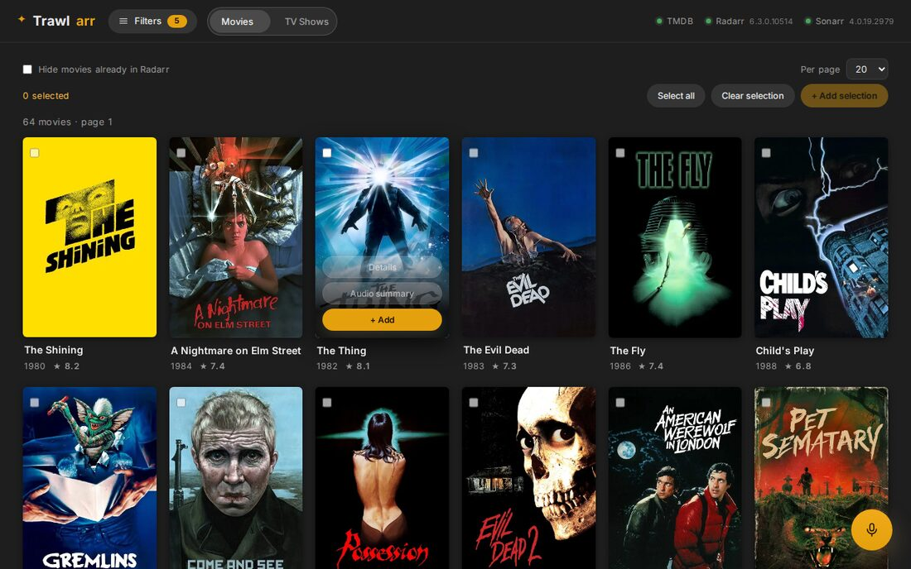

<div align="center">

# Trawlarr

**Cast a net over TMDB. Trawlarr keeps Radarr and Sonarr filled.**

Every TMDB Discover filter in front of your \*arr stack — plus saved searches that
keep adding new releases on their own, and an assistant you can just talk to.

[](LICENSE)
[](https://github.com/NoxzRCW/Trawlarr/pkgs/container/trawlarr)
[](https://github.com/NoxzRCW/Trawlarr/actions/workflows/docker.yml)
[](requirements.txt)
[](https://fastapi.tiangolo.com/)
[](https://radarr.video/)
[](https://sonarr.tv/)

</div>


---

## Why this exists

Radarr and Sonarr are excellent at **getting** what you ask for. They were never
built to help you **decide what to ask for**. Their add-search takes a title, and
that is the whole conversation.

But nobody thinks in titles. People think:

> *"80s horror, rated above 6.5, with enough votes that it isn't obscure."*
> *"Korean thrillers from the last five years that I don't already have."*
> *"Everything A24 ever produced."*

TMDB can answer all of that — its Discover API is genuinely powerful. Nothing
sat between it and the \*arr stack. **Trawlarr is that missing piece.**

## What you get

### 🎣 Every TMDB filter, not a title box

Genres to include **and** exclude, release windows, rating and vote-count floors,
runtime, original language, origin country, age certification, cast and crew,
keywords, production companies, streaming providers and monetisation type.
Results show what is **already in your library**, so you only see what is missing.

Select a handful — or all of them — and push them to Radarr or Sonarr in one click,
with the quality profile, root folder and monitoring you choose. Movies can pull
in **their whole collection** at the same time.

### 🔁 Turn any search into an auto-list

This is the part people keep for good.

Save a set of filters as a **list**. Trawlarr re-runs it every 12 hours and adds
whatever is new and matching, straight into Radarr or Sonarr. *"Every A24 film
that comes out"* stops being a chore and becomes a line in a list.

Preview a list before saving it: it tells you exactly how many titles it scanned,
how many are new, and how many you already own — without adding anything.

<p align="center"></p>

### 🎙️ Or just ask

Type — or say — *"highly rated sci-fi from the 90s"*, *"shows like Breaking Bad"*,
*"I don't know what to watch tonight"*. The assistant turns that into real filters,
applies them, and runs the search. Optional: it only wakes up if you give it a
Mistral API key.


It will also read you a **spoiler-free spoken summary** of any title, so you can
decide without reading three paragraphs.

---

## Quick start

You need a free [TMDB API key](https://www.themoviedb.org/settings/api) (2 minutes)
plus your Radarr and Sonarr API keys, from *Settings → General*.

```bash
docker run -d --name trawlarr -p 127.0.0.1:8080:8080 \
  -e TMDB_API_KEY=xxxxx \
  -e RADARR_URL=http://radarr:7878 -e RADARR_API_KEY=xxxxx \
  -e SONARR_URL=http://sonarr:8989 -e SONARR_API_KEY=xxxxx \
  -v "$(pwd)/data:/data" \
  ghcr.io/noxzrcw/trawlarr:latest
```

Open **http://localhost:8080**. That is the whole install — the image is prebuilt
for `amd64`, nothing to compile.

> **Note on the volume.** Trawlarr runs as uid 1000 inside the container. Create the
> data directory first so it belongs to you: `mkdir -p data && chown 1000:1000 data`.
> Only `lists.json` lives there — nothing touches your media folders.

<details>
<summary>Prefer docker compose, or want to build it yourself?</summary>

```bash
git clone https://github.com/NoxzRCW/Trawlarr.git
cd Trawlarr
cp .env.example .env
$EDITOR .env          # TMDB_API_KEY + your Radarr / Sonarr URL and API key
mkdir -p data         # created before Docker does, so it belongs to you
docker compose up -d
```

The compose file runs the container as `${PUID:-1000}:${PGID:-1000}`. If your
user is not uid 1000, set `PUID` and `PGID` in `.env` — otherwise the container
cannot write its auto-lists to `./data`.

</details>

> **Radarr in another container?** Put Trawlarr on the same Docker network and use
> the service name (`http://radarr:7878`), or `http://host.docker.internal:7878`.

## Configuration

Trawlarr is configured entirely through environment variables. The table below covers
the ones worth knowing; [`.env.example`](.env.example) documents all of them.

The container always listens on **8080** — change the host side of the port mapping
(`-p 9090:8080`), not a variable.

| Variable | What it does | Default |
|---|---|---|
| `TMDB_API_KEY` | TMDB v3 API key — **required** | — |
| `TMDB_LANGUAGE` | Metadata language | `en-US` |
| `TMDB_REGION` | Region for release dates and streaming providers | `US` |
| `RADARR_URL` / `RADARR_API_KEY` | Your Radarr instance | — |
| `SONARR_URL` / `SONARR_API_KEY` | Your Sonarr instance | — |
| `DATA_DIR` | Where `lists.json` is written — **this is what you back up** | `/data` |
| `RADARR_QUALITY_PROFILE_ID` · `RADARR_ROOT_FOLDER` | Defaults when adding a movie | first available |
| `SONARR_QUALITY_PROFILE_ID` · `SONARR_ROOT_FOLDER` | Defaults when adding a series | first available |
| `RADARR_MINIMUM_AVAILABILITY` | `announced` · `inCinemas` · `released` | `released` |
| `SONARR_SERIES_TYPE` | `standard` · `anime` · `daily` | `standard` |
| `SONARR_SEASON_FOLDER` | Create one folder per season | `true` |
| `RADARR_MONITOR` / `SONARR_MONITOR` | Monitor a title once it is added | `true` |
| `RADARR_SEARCH_ON_ADD` / `SONARR_SEARCH_ON_ADD` | Trigger a search right after adding | `true` |
| `LIST_REFRESH_HOURS` | How often auto-lists re-scan | `12` |
| `LIST_MAX_PAGES` | TMDB pages per scan (~20 titles each) | `3` |
| `MISTRAL_API_KEY` | Enables the assistant — leave empty to hide it | — |
| `MISTRAL_MODEL` | Model the assistant calls | `mistral-large-latest` |
| `ASSISTANT_LANGUAGE` | Language the assistant answers in | from `TMDB_LANGUAGE` |

**Your API keys never reach the browser.** Every call to TMDB, Radarr and Sonarr is
made server-side; the frontend only ever talks to this container.

## Security

> **Trawlarr has no authentication.** Anyone who can reach the port can add titles to
> your library, create auto-lists, and read your Radarr/Sonarr root folder paths. It is
> designed to sit on a trusted network: put it behind an authenticated reverse proxy, a
> VPN, or Tailscale, and never expose it directly to the Internet.
>
> The default compose file binds to `127.0.0.1` only. If you enable the optional Mistral
> assistant, note that the endpoint spends your own API quota — one more reason not to
> expose it.
>
> Found a security issue? Report it privately through
> [GitHub security advisories](https://github.com/NoxzRCW/Trawlarr/security/advisories/new).

## Screenshots

<table>
<tr>
<td width="50%"><br><sub><b>Filters live in a drawer</b> so the posters get the full width; owned titles are flagged</sub></td>
<td width="50%"><br><sub><b>Full TMDB detail sheet</b> — cast, crew, trailers, where to watch, similar titles</sub></td>
</tr>
<tr>
<td width="50%"><br><sub><b>Any search becomes a list</b> that keeps feeding your library</sub></td>
<td width="50%"><br><sub><b>Actions live on the artwork</b> — details, spoken summary and add, on hover</sub></td>
</tr>
</table>

## How it works

```
Browser ──> Trawlarr (FastAPI) ──> TMDB API      discover · search · metadata
                               ├─> Radarr API    library check · add movies
                               ├─> Sonarr API    library check · add series
                               └─> Mistral API   optional, natural-language only
```

- **Backend** — FastAPI. Proxies and enriches; holds every credential.
- **Frontend** — a static SPA in vanilla JavaScript. No build step, no framework, no CDN.
- **Auto-lists** — a background scheduler persists to `lists.json` in `DATA_DIR`.
- **TMDB → TVDB** — Sonarr indexes shows by TVDB id, so Trawlarr bridges the two
  through TMDB `external_ids`, cached.
- **Trust boundary** — Trawlarr holds your TMDB, Radarr and Sonarr credentials and
  trusts everyone who can reach its port. Keep that port on a network you control.

<details>
<summary>Main API endpoints</summary>

| Endpoint | Purpose |
|---|---|
| `GET /api/discover` | Advanced search — every TMDB Discover parameter |
| `GET /api/search?query=` | Title search |
| `GET /api/tv/discover` · `GET /api/tv/search` | Same, for TV shows |
| `GET /api/tmdb/genres` · `watch-providers` · `certifications` | Reference data |
| `GET /api/tmdb/search/{person,company,keyword}` | Autocomplete |
| `POST /api/radarr/add` · `POST /api/sonarr/add` | Add a title |
| `GET /api/lists` · `POST /api/lists` · `POST /api/lists/preview` | Auto-lists |
| `GET /api/health` | TMDB / Radarr / Sonarr connectivity |

</details>

## Translations

The interface ships in **English and French**. Adding a language means adding one
object to [`app/static/i18n.js`](app/static/i18n.js) — the keys are the English
strings themselves, so there is nothing to extract and no build step.

Trawlarr picks the language from your browser and falls back to English. To force one,
run `localStorage.setItem('ui-lang','fr')` in the browser console — there is no language
switcher in the UI yet.

Translations are the easiest possible first contribution: one object, no build step,
no Python.

## Development

```bash
python -m venv .venv && source .venv/bin/activate
pip install -r requirements.txt -r requirements-dev.txt
cp .env.example .env    # TMDB key, Radarr/Sonarr URLs, and set DATA_DIR=./data
uvicorn app.main:app --reload --port 8080
pytest -q
```

`DATA_DIR` defaults to `/data`, which only exists inside the container — point it at
`./data` for local work. The frontend is served straight from `app/static/`, so a
browser refresh is enough after a JS or CSS change — bump the `?v=` suffix in
`index.html` if your browser caches it.

If an auto-list is not doing what you expect, `docker logs trawlarr` now tells
you exactly what each scan did — how many titles were checked, added, skipped,
and the reason behind every error.

## Contributing

Issues and pull requests are welcome — bug reports, new filters, translations,
or provider integrations. [CONTRIBUTING.md](CONTRIBUTING.md) covers running it
locally, what gets merged easily, and what will be turned down. Security
problems go through [SECURITY.md](SECURITY.md), never a public issue.

## Credits

Metadata and artwork from [TMDB](https://www.themoviedb.org/). This product uses the
TMDB API but is not endorsed or certified by TMDB. Built to sit alongside
[Radarr](https://radarr.video/) and [Sonarr](https://sonarr.tv/).

## License

[MIT](LICENSE)
